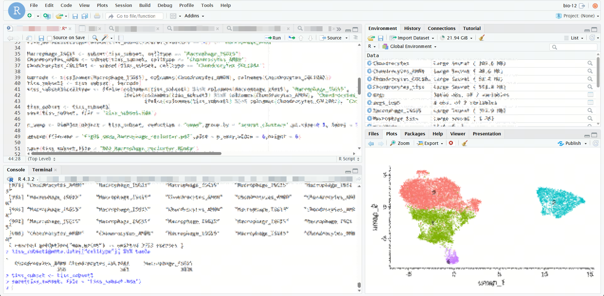
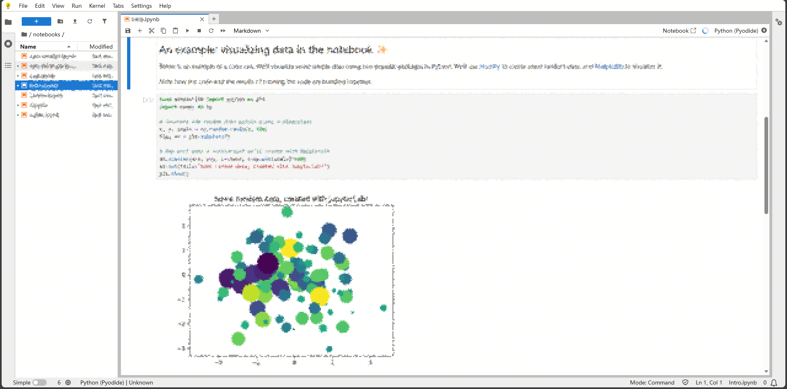

<p align="center">
  
</p>

<h1 align="center">Bioclaw</h1>

<p align="center">
  <strong>开源生物科研环境一键安装包</strong><br>
  <em>Zero to Bio-Research Environment in 10 Minutes</em>
</p>

<p align="center">
  <a href="https://github.com/Rowtion/Bioclaw/blob/main/LICENSE">
    
  </a>
  <a href="#installation">
    
  </a>
  <a href="https://opencode.dev">
    
  </a>
  <a href="README_CN.md">
    
  </a>
</p>

<p align="center">
  <a href="https://github.com/Rowtion/Bioclaw">English</a> • 
  <a href="README_CN.md">简体中文</a> • 
  <a href="#quick-start">快速开始</a> • 
  <a href="#features">特性</a> • 
  <a href="#screenshots">截图</a>
</p>

---

## 🎯 What is Bioclaw?

**Bioclaw** is an open-source integration package that sets up a complete bio-research environment with one command.

**In 10 minutes, you get:**
- 🧬 **RStudio Server** - Professional statistical computing environment
- 🐍 **JupyterLab** - Interactive Python data science notebook
- 🤖 **AI Assistant** - Natural language bio-analysis via messaging apps
- 📦 **Pre-installed Tools** - 150+ curated bio-research skills

**Perfect for:**
- 🔬 Researchers who need a standardized analysis environment
- 🎓 Students learning bioinformatics
- 👥 Teams sharing reproducible workflows
- 🚀 Anyone who hates configuration hell

---

## ✨ Features

<table>
<tr>
<td width="50%">

### 🚀 One-Command Installation
```bash
curl -fsSL https://.../install.sh | bash
```
No Docker knowledge required. No complex configuration. Just works.

</td>
<td width="50%">

### 🐳 Fully Containerized
Everything runs in Docker containers:
- Isolated from your system
- Reproducible across machines
- Easy to update/rollback

</td>
</tr>
<tr>
<td width="50%">

### 💬 AI-Powered Analysis
Talk to your data:
- "Analyze this gene expression data"
- "Plot a volcano chart"
- "Search PubMed for CRISPR papers"

</td>
<td width="50%">

### 📊 Professional Tools
Pre-configured with:
- R 4.3 + Bioconductor (DESeq2, Seurat)
- Python 3 + scanpy, biopython
- 150+ bio-research skills

</td>
</tr>
</table>

---

## 🚀 Quick Start

### Prerequisites
- **macOS** 10.14+ or **Linux** (Ubuntu 20.04+)
- **Docker Desktop** ([Install Guide](https://docs.docker.com/get-docker/))

### Installation

```bash
# Download and install
curl -fsSL https://raw.githubusercontent.com/Rowtion/Bioclaw/main/install.sh | bash

# Start Bioclaw
bioclaw start
```

**That's it!** 

After 5-10 minutes, access your research environment:

| Service | URL | Password |
|---------|-----|----------|
| **RStudio** | http://localhost:8787 | `bioclaw` |
| **JupyterLab** | http://localhost:8888 | `bioclaw` |

---

## 📸 Screenshots

<p align="center">
  
  &nbsp;&nbsp;
  
</p>

*RStudio Server and JupyterLab interfaces*

---

## 🎬 Demo

```bash
# Example 1: Start and analyze data
$ bioclaw start
✅ Bioclaw started!
# Open http://localhost:8787 in browser

# Example 2: Use AI assistant (in Slack/Feishu)
User: "用opencode分析我的单细胞数据"
AI: "正在使用scanpy进行分析..."
[Generates UMAP plot, saves to ./outputs/]

# Example 3: Stop when done
$ bioclaw stop
✅ Bioclaw stopped
```

---

## 🏗️ Architecture

```
┌─────────────────────────────────────────────────────────────┐
│                     Your Computer                            │
│  ┌─────────────┐    ┌──────────────┐    ┌────────────────┐ │
│  │   Browser   │    │  Slack/飞书   │    │   Terminal     │ │
│  └──────┬──────┘    └───────┬──────┘    └───────┬────────┘ │
│         │                   │                    │          │
│         └───────────────────┼────────────────────┘          │
│                             │                               │
│                    ┌────────┴────────┐                      │
│                    │  OpenClaw       │                      │
│                    │  (AI Gateway)   │                      │
│                    └────────┬────────┘                      │
│                             │ HTTP                          │
│                    ┌────────┴────────┐                      │
│                    │  Opencode       │                      │
│                    │  (Port 4096)    │                      │
│                    └────────┬────────┘                      │
│                             │                               │
│         ┌───────────────────┴───────────────────┐          │
│         │           Docker Environment           │          │
│         │  ┌───────────────────────────────┐    │          │
│         │  │  RStudio (:8787)              │    │          │
│         │  │  • R + Bioconductor           │    │          │
│         │  └───────────────────────────────┘    │          │
│         │  ┌───────────────────────────────┐    │          │
│         │  │  JupyterLab (:8888)           │    │          │
│         │  │  • Python + scanpy            │    │          │
│         │  └───────────────────────────────┘    │          │
│         └───────────────────────────────────────┘          │
└─────────────────────────────────────────────────────────────┘
```

---

## 🛠️ Installation Methods

### Method 1: One-Line Install (Recommended)
```bash
curl -fsSL https://raw.githubusercontent.com/Rowtion/Bioclaw/main/install.sh | bash
```

### Method 2: Manual Installation
```bash
# Clone repository
git clone https://github.com/Rowtion/Bioclaw.git ~/.bioclaw
cd ~/.bioclaw

# Run setup
bash install.sh
```

### Method 3: GUI Interface (macOS)
```bash
# Install
bash install.sh

# Launch GUI
open ~/.bioclaw/Bioclaw.app
```

---

## 📚 Usage Guide

### Basic Commands

```bash
# Start Bioclaw
bioclaw start

# Check status
bioclaw status

# View logs
bioclaw logs

# Stop Bioclaw
bioclaw stop

# Update to latest version
bioclaw update
```

### Working with Data

**Upload data:**
```bash
# Copy files to data directory
cp my_data.csv ~/.bioclaw/data/

# Access in RStudio/JupyterLab
# Path: /home/rstudio/data/
```

**Save results:**
```bash
# Results automatically saved to
~/.bioclaw/outputs/
```

### AI Assistant Usage

1. Configure Opencode:
```bash
~/.opencode/bin/opencode auth login
```

2. Send message in Slack/Feishu:
```
"帮我用DESeq2做差异表达分析"
"Plot a heatmap of top 50 genes"
"Search PubMed for COVID-19 vaccine papers"
```

---

## 🔧 Advanced Configuration

### Change Default Password

Edit `.env` file:
```bash
cd ~/.bioclaw
nano .env

# Change these:
RSTUDIO_PASSWORD=your_secure_password
JUPYTER_TOKEN=your_secure_token
```

Restart:
```bash
docker-compose restart
```

### Enable Remote Access

See [docs/REMOTE_ACCESS.md](docs/REMOTE_ACCESS.md)

### Add Custom Skills

Drop your skills into:
```
~/.bioclaw/scientific-skills/
```

---

## 🐛 Troubleshooting

### Installation Issues

**Q: Docker not found**
```bash
# macOS: Install Docker Desktop from https://docs.docker.com/desktop/install/mac-install/
# Ubuntu: sudo apt-get install docker.io
```

**Q: Port already in use**
```bash
# Check what's using port 8787
lsof -i :8787

# Kill process or change port in docker-compose.yml
```

**Q: Build fails**
```bash
# Check Docker daemon is running
docker info

# Retry build
cd ~/.bioclaw && docker-compose build --no-cache
```

### Runtime Issues

**Q: Cannot access localhost:8787**
- Ensure Bioclaw is running: `bioclaw status`
- Check firewall settings
- Try http://127.0.0.1:8787

**Q: Forgot password**
- Default: `bioclaw`
- Change in `~/.bioclaw/.env`

More issues? See [FAQ.md](FAQ.md)

---

## 🤝 Contributing

We welcome contributions!

### Ways to Contribute
- 🐛 Report bugs
- 💡 Suggest features
- 📝 Improve documentation
- 🔧 Submit pull requests

### Development Setup

```bash
# Fork and clone
git clone https://github.com/YOUR_USERNAME/Bioclaw.git
cd Bioclaw

# Test changes
bash install.sh
```

See [CONTRIBUTING.md](CONTRIBUTING.md) for guidelines.

---

## 📄 License

This project is licensed under the [MIT License](LICENSE).

---

## 🙏 Acknowledgments

Bioclaw wouldn't be possible without:

- [OpenClaw](https://github.com/openclaw/openclaw) - AI conversation gateway
- [Opencode](https://opencode.dev) - Code execution environment
- [Docker](https://docker.com) - Container platform
- [RStudio](https://rstudio.com) - Statistical computing IDE
- [Project Jupyter](https://jupyter.org) - Interactive computing

---

<p align="center">
  <strong>Made with ❤️ for the research community</strong><br>
  <a href="https://github.com/Rowtion/Bioclaw">⭐ Star us on GitHub</a> • 
  <a href="https://github.com/Rowtion/Bioclaw/issues">🐛 Report Issues</a>
</p>
