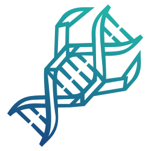

<p align="center">
  
</p>

<h1 align="center">Bioclaw</h1>

<p align="center">
  <strong>Open-Source Biomedical AI Research Assistant</strong><br>
  OpenClaw × Opencode × K-Dense Scientific Skills
</p>

<p align="center">
  <a href="https://github.com/Rowtion/Bioclaw/blob/main/LICENSE">
    
  </a>
  <a href="https://github.com/Rowtion/Bioclaw">
    
  </a>
  <a href="https://opencode.dev">
    
  </a>
</p>

---

## Table of Contents

- [Overview](#overview)
- [Features](#features)
- [Architecture](#architecture)
- [Quick Start](#quick-start)
- [Configuration](#configuration)
- [Available Skills](#available-skills)
- [Troubleshooting](#troubleshooting)
- [Contributing](#contributing)
- [License](#license)

## Overview

**Bioclaw** is an open-source scientific AI research assistant that enables researchers to perform complex data analysis through natural language conversations. It integrates three powerful components:

- **OpenClaw**: Conversational AI gateway that connects to your favorite messaging platforms (Feishu, WhatsApp, Slack, Discord)
- **Opencode**: Lightweight, self-hosted code execution environment
- **K-Dense Scientific Skills**: A curated collection of scientific computing skills covering bioinformatics, data analysis, literature search, and more

### Why Bioclaw?

| Feature | Benefit |
|---------|---------|
| 🔬 **Research-Ready** | 140+ pre-built skills for common scientific tasks |
| 💬 **Conversational** | Interact via messaging apps you already use |
| 🔒 **Self-Hosted** | Your data stays on your machine |
| 🚀 **Extensible** | Easy to add custom skills |
| 🐳 **Containerized** | Reproducible analysis environment via Docker |

## Features

### Core Capabilities

- **Clinical Research**: Trial design, patient data analysis, diagnostic support
- **Bioinformatics**: Genomics, transcriptomics, proteomics workflows
- **Data Analysis**: Statistical analysis, visualization, machine learning
- **Literature Synthesis**: Literature search, systematic reviews, evidence grading
- **Pharmaceutical Research**: Drug discovery, ADMET prediction, target analysis

### Supported Platforms

- Feishu (飞书)
- WhatsApp
- Slack
- Discord
- And more via OpenClaw plugins

## Architecture

```
┌─────────────────────────────────────────────────────────────────┐
│                         User Layer                               │
│  ┌─────────┐  ┌─────────┐  ┌─────────┐  ┌─────────────────┐    │
│  │  Feishu │  │ WhatsApp│  │  Slack  │  │     Discord     │    │
│  └────┬────┘  └────┬────┘  └────┬────┘  └────────┬────────┘    │
└───────┼────────────┼────────────┼────────────────┼─────────────┘
        │            │            │                │
        └────────────┴────────────┴────────────────┘
                          │
                          ▼
┌─────────────────────────────────────────────────────────────────┐
│                      OpenClaw Gateway                            │
│                   (Message Routing Layer)                        │
└──────────────────────────┬──────────────────────────────────────┘
                           │
                           ▼
┌─────────────────────────────────────────────────────────────────┐
│                   opencode-bridge Skill                          │
│              (OpenClaw → Opencode Integration)                   │
└──────────────────────────┬──────────────────────────────────────┘
                           │ HTTP API
                           ▼
┌─────────────────────────────────────────────────────────────────┐
│                     Opencode Server                              │
│              (localhost:4096, Code Execution)                    │
└──────────────────────────┬──────────────────────────────────────┘
                           │
                           ▼
┌─────────────────────────────────────────────────────────────────┐
│              K-Dense Scientific Skills                           │
│                      (140+ Skills)                               │
└──────────────────────────┬──────────────────────────────────────┘
                           │
                           ▼
┌─────────────────────────────────────────────────────────────────┐
│                 Docker Analysis Environment                      │
│                                                                  │
│  ┌─────────────────────┐    ┌─────────────────────┐             │
│  │   RStudio Server    │    │     JupyterLab      │             │
│  │      (:8787)        │    │      (:8888)        │             │
│  │                     │    │                     │             │
│  │  • R 4.3.3          │    │  • Python 3         │             │
│  │  • Bioconductor     │    │  • scanpy           │             │
│  │  • DESeq2, Seurat   │    │  • biopython        │             │
│  │  • tidyverse        │    │  • scikit-learn     │             │
│  └─────────────────────┘    └─────────────────────┘             │
└─────────────────────────────────────────────────────────────────┘
```

## Quick Start

### Prerequisites

- [Docker](https://docs.docker.com/get-docker/) and docker-compose
- [Git](https://git-scm.com/)

### One-Line Installation

```bash
# Clone and install everything
git clone --recurse-submodules https://github.com/Rowtion/Bioclaw.git
cd Bioclaw
bash setup.sh
```

That's it! The `setup.sh` script automatically:
- ✅ Installs OpenClaw and Opencode (if not present)
- ✅ Pulls K-Dense scientific skills (140+)
- ✅ Builds and starts Docker services (RStudio + JupyterLab)
- ✅ Configures OpenClaw with Bioclaw identity
- ✅ Starts Opencode server on port 4096

### Configure API Access

After installation, set up your AI model provider:

```bash
# Configure API keys
~/.opencode/bin/opencode auth login

# Verify installation
openclaw gateway restart
```

**Note:** The `auth login` command will guide you through selecting and configuring your model provider (Anthropic Claude, OpenAI, OpenRouter, etc.).

### Start Using

Send messages through your connected messaging platform:

**Bioinformatics:**
```
Analyze my single-cell RNA-seq data using scanpy
```

**Data Analysis:**
```
Perform differential expression analysis on my count matrix
```

**Literature Research:**
```
Search PubMed for recent CRISPR papers and create a summary
```

**Programming:**
```
Help me visualize this data with matplotlib
```

Results are saved to `./outputs/` and can be viewed in:
- **RStudio Server**: http://localhost:8787 (password: `bioclaw`)
- **JupyterLab**: http://localhost:8888 (token: `bioclaw`)

## Configuration

### 1. Configure Opencode API Access

Opencode manages API keys through its own authentication system:

```bash
# Login to your model provider
~/.opencode/bin/opencode auth login

# Or if opencode is in your PATH
opencode auth login

# List configured providers
opencode auth list
```

Supported providers: Anthropic (Claude), OpenAI, and others via OpenRouter.

### 2. Environment File (Optional)

The `.env` file is created automatically during setup. Edit only if you need customization:

```bash
nano .env
```

Common customizations:
```bash
# Change default passwords (recommended for production)
RSTUDIO_PASSWORD=your_secure_password

# Adjust Opencode timeout for long analyses
OPENCODE_TIMEOUT=600
```

## Available Skills

K-Dense Scientific Skills includes 140+ skills organized by domain:

| Category | Skills | Examples |
|----------|--------|----------|
| 🔬 **Bioinformatics** | 25+ | Genomics, transcriptomics, proteomics, metabolomics |
| 📊 **Data Analysis** | 30+ | Statistical analysis, visualization, machine learning |
| 📚 **Literature & Search** | 20+ | Literature search, paper analysis, citation management |
| 🧪 **Lab Tools** | 15+ | Protocol design, reagent calculation, experiment tracking |
| 💻 **Programming** | 20+ | Python, R, data processing, automation |
| 🗄️ **Databases** | 15+ | PubMed, ChEMBL, ClinicalTrials.gov integration |
| 📝 **Publishing** | 10+ | Figure creation, manuscript formatting, peer review |
| 🔧 **Utilities** | 10+ | File conversion, data cleaning, API tools |

Browse all skills at: https://github.com/K-Dense-AI/claude-scientific-skills

## Troubleshooting

### Opencode Connection Issues

```bash
# Check if Opencode is running
curl http://localhost:4096/status

# View Opencode logs
~/.opencode/bin/opencode logs

# Restart Opencode
~/.opencode/bin/opencode serve --port 4096
```

### Docker Services Won't Start

```bash
# View container logs
docker-compose logs

# Rebuild images (no cache)
docker-compose down
docker-compose build --no-cache
docker-compose up -d

# Check container status
docker-compose ps
```

### Skills Not Triggering

1. Verify bridge skill is installed:
   ```bash
   ls ~/.openclaw/workspace/skills/opencode-bridge/
   ```

2. Check OpenClaw skill recognition:
   ```bash
   openclaw skills check
   ```

3. Ensure trigger words are in your message:
   - `用opencode`, `opencode分析`, `医学分析`, `生物信息学`
   - `clinical analysis`, `research analysis`, `run analysis`

## Project Structure

```
Bioclaw/
├── docker/
│   ├── Dockerfile              # R + Python analysis environment
│   └── entrypoint.sh           # Service startup script
│
├── skills/
│   └── opencode-bridge/        # OpenClaw → Opencode bridge
│       ├── SKILL.md
│       └── scripts/
│           └── bridge.py       # Bridge implementation
│
├── docs/
│   ├── API.md                  # API documentation
│   ├── ARCHITECTURE.md         # System architecture details
│   └── QUICKSTART_ZH.md        # 中文快速开始
│
├── data/                       # Data directory (mounted to containers)
├── outputs/                    # Analysis outputs (mounted to containers)
│
├── docker-compose.yml          # Docker services configuration
├── setup.sh                    # Installation script
├── .env.template               # Environment variables template
├── .gitignore
├── CLAUDE.md                   # AI agent context
├── CONTRIBUTING.md             # Contribution guidelines
├── LICENSE                     # MIT License
└── README.md                   # This file
```

## Contributing

We welcome contributions! Please see [CONTRIBUTING.md](CONTRIBUTING.md) for guidelines.

Ways to contribute:
- 🐛 Report bugs
- 💡 Suggest new features
- 📝 Improve documentation
- 🔧 Submit bug fixes
- ✨ Add new scientific computing skills

## Comparison with Similar Projects

| Aspect | MedgeClaw | Bioclaw |
|--------|-----------|-------------|
| Execution Engine | Claude Code | **Opencode** (self-hosted) |
| Skill Library | K-Dense (140 skills) | **K-Dense Scientific Skills** |
| Gateway | OpenClaw | **OpenClaw** |
| Analysis Environment | Docker | **Docker** |
| Messaging Platforms | WhatsApp/Slack/Discord | **Feishu/WhatsApp/Slack/Discord** |
| API Flexibility | Anthropic only | **Multiple providers supported** |

## License

This project is licensed under the [MIT License](LICENSE).

## Acknowledgments

- [OpenClaw](https://github.com/openclaw/openclaw) - Conversational AI gateway
- [Opencode](https://opencode.dev) - Code execution environment
- [K-Dense](https://github.com/K-Dense-AI) - Scientific computing skills
- [K-Dense Scientific Skills](https://github.com/K-Dense-AI/claude-scientific-skills) - Skill library

## Links

- 🏠 **Repository**: https://github.com/Rowtion/Bioclaw
- 📖 **Documentation**: See `docs/` directory
- 🐛 **Issues**: https://github.com/Rowtion/Bioclaw/issues
- 💬 **Discussions**: https://github.com/Rowtion/Bioclaw/discussions

---

<p align="center">
  Made with ❤️ for scientific researchers worldwide
</p>
